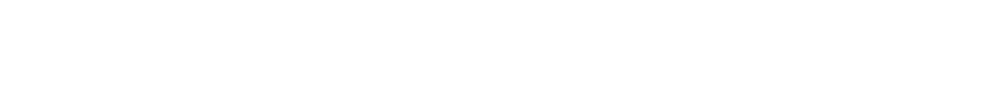

---

 

<!-- Note: -->

> [!IMPORTANT]
> Este proyecto ya no se encuentra en desarrollo ni se le dará mantenimiento activo. La continuación de este proyecto se encuentra en [4l3j0Ok/alejoide-web](https://github.com/4l3j0Ok/alejoide-web) y está desarrollado con [Astro](https://astro.build).

## Introducción

Este proyecto es un sitio web personal que contiene información sobre mi, mis proyectos, mis habilidades y mi experiencia laboral.

El sitio web está desarrollado con [Reflex](https://reflex.dev), un framework de desarrollo web basado en Python.

Puedes acceder al sitio visitando [www.alejoide.com](https://alejoide.com).
